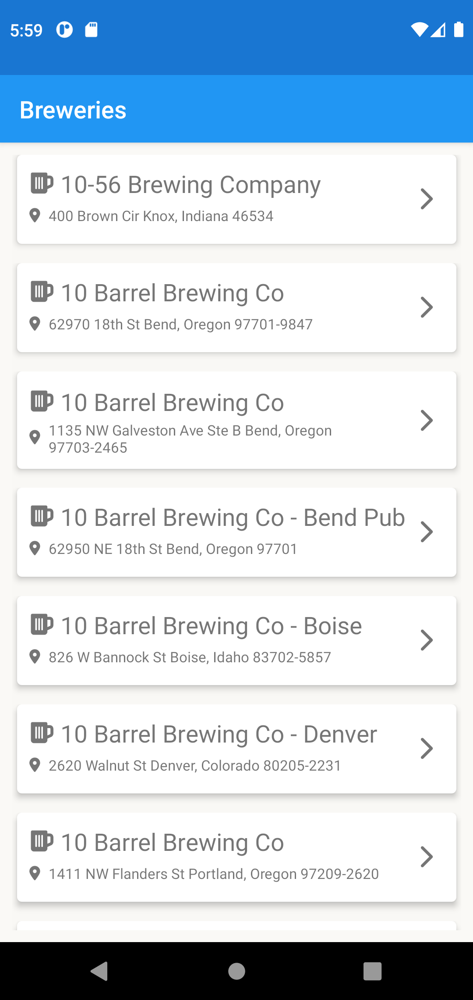
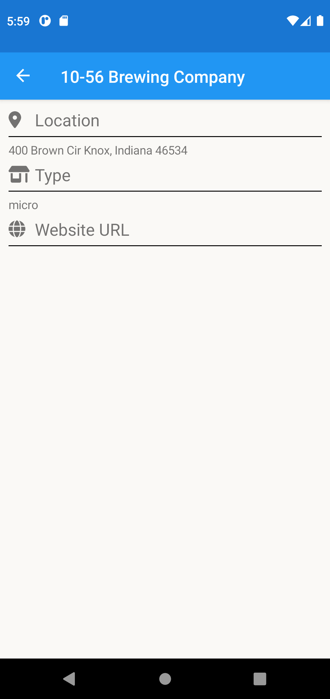
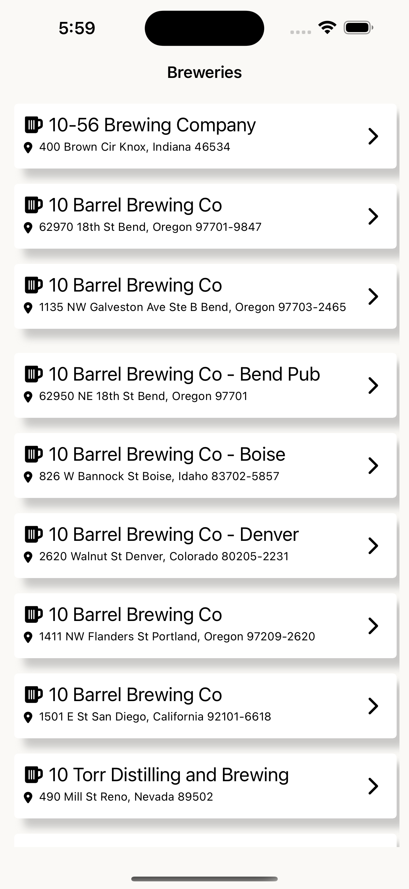
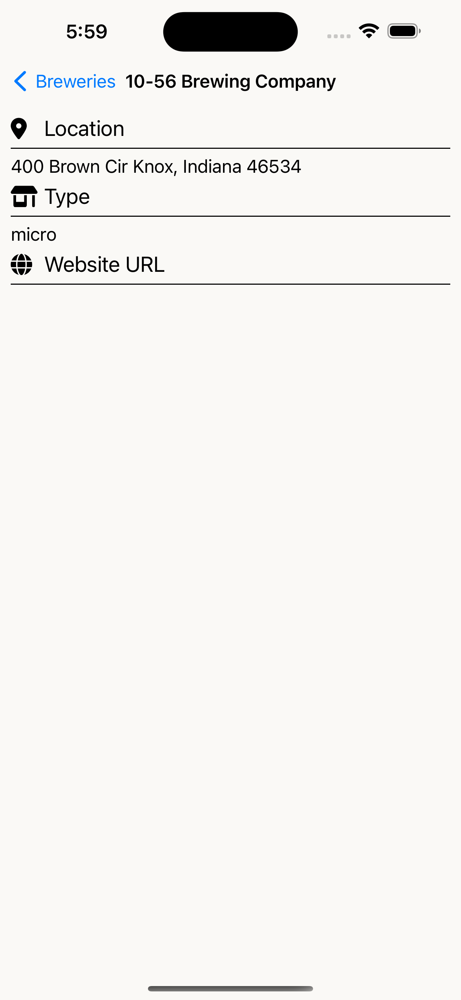

# 📱 FreshInterview
Xamarin Forms app for Technical Interview at Fresh Technologies

## 🏃‍♀️ Running the project
- Visual Studio installed
- Android SDKs intalled with relevant sims
- XCode installed with relevant sims

## 🧪 Tech Used:
- Xamarin Forms
- MVVM Community Toolkit
- Xamarin Pancake View
- Font awesome
- Microsoft Dependency injection

## 📝 Description
This app loads data from (Open Brewery DB)[https://www.openbrewerydb.org/documentation] and displays it in a basic collection view. The app will also attempt to infinitely load breweries in the collection view. There is a brief detail screen that will show additional information about the brewery.

## 🎲 Things I would improve:
If I spent a bit more time on this I would attempt to improve the following:
1. Design (especially iOS)
2. Adding a map and using the coordinates provided in the API to the detail page.
3. The ability to search breweries using different criteria
4. Possibly unit tests

🏃

